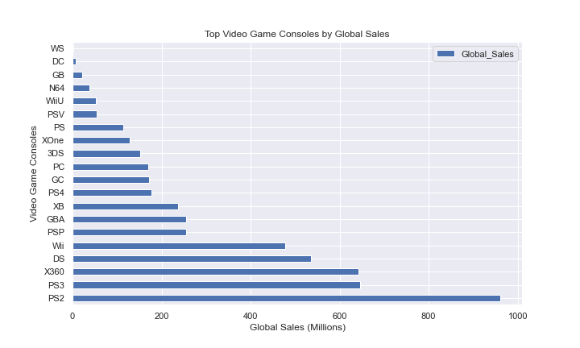

# Capstone Project

**Author**: [Nat Berryman](https://github.com/natberr)

## Project Overview

The purpose of this regression model is to predict the global sales of Video Games by analysing the Video Game Sales
dataset from [Kaggle](https://www.kaggle.com/datasets/xtyscut/video-games-sales-as-at-22-dec-2016csv).

### Business Problem

VG Corp. have moved into the Video Game industry and want a predictive model to understand what video games to produce.

To assist VG Corp. in making the right decisions I intended to determine what certain varibales have on Global Sales:
1. Platform
2. Genre
3. Publisher

### The Data

This project uses the Video Game Sales dataset, which can be found in  `Video_Games_Sales_as_at_22_Dec_2016.csv` in the data folder in this repo.

**Data Cleaning**
- Dropped unnecessary data
- Replaced or removed null values
- Narrowed data to only include sales between 2010-2016
- Using the empirical formula I removed outliers
- Addressed multicollinearity
- Split data set between continuous and categorical data
- Grouped Publisher data into Small, Medium and Large
- Created additional variables including total engagement and average score

### Exploratory Data Analysis

No key features stood out that showed positive correlation with Global Sales.
Further analysis required to identify any positive correlation with Global Sales.

Global Sales for Video Games are highest on the PS2 console while Action games are the highest selling following by Sports and Shooter
Using the platform visualization I modelled two sets of data, individual platforms and then grouping platform together by maker e.g. PS, PS2 and PS3 under Sony and XOne, X360 under Microsoft
Number of games peaked in 2008 and 2009 but had declined since





Used mean normalization to standardise the data
All features appear good however  the critic and user variables are somewhat negatively skewed

### Models

Unfortunately no models could provide concrete recommendations


### Conclusions

While there is highly performing genres, platforms and publishers the Global Sales can’t be accurately predicted using OLS and Polynomial Regression modelling
It is suggested that advanced regression models are used to drive decisions
It is however recommended that insights are used for focus areas such has highly performing genres, engagement and consoles

### For More Information

Please review the full analysis in [my Jupyter Notebook](http://localhost:8888/notebooks/Desktop/AcademyXI/ProjectThree/Video%20Game%20Analysis-Copy1.ipynb) or my [presentation pack]

For any additional questions, please contact **Nat Berryman** - nathaniel.berryman@gmail.com

### Repository Structure

```
├── data
├── images
├── Video Game Analysis-Copy1.ipynb
├── README.md
└── video game presentation.pdf
```